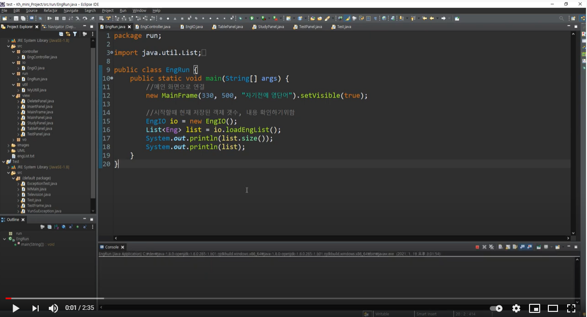
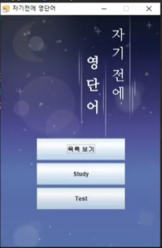
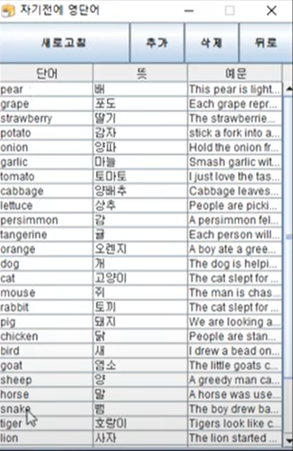
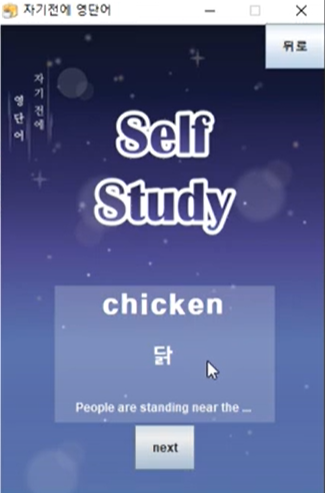
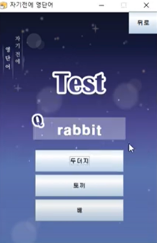

# 2021_Mini_Project(자기전에 영단어)

## 1. 개요

- Java 학습한 내용을 바탕으로 어플리케이션 제작을 함
- 자기전에 영단어(프로젝트명)은 간단한 나만의 영단어장으로
- 단어를 등록,삭제 하고 암기하고 테스트를 볼수있는 프로그램이다.
- (youtube 시연 동영상)

---

## 2. 제작기간

### 210113~210115

- Java수업을 마치고 강의시간도 프로젝트 제작 시간으로 주어져서 비교적 짧은 기간 안에 제작 하였다.

---

## 3. 개발 목표 및 주안점

### 개발목표

- 배운 기술들을 최대한 활용해서 작업하고 전반적인 사용 기술의 이해를 목표로 진행

### 주안점

- 데이터는 IOStream을 활용해서 파일에 저장, GUI는 JavaSwing을 활용하여 구현

---

## 4. 레이아웃

## 1)Main 화면

## 2)Table(단어관리) 화면

## 2.1)단어추가 화면

## 2.2)단어삭제 화면

## 3)Study 화면

## 4)Test 화면

---

## 5. 팀원

김윤수 : 팀장, 프로젝트 설계 및 구현

남윤지 : 팀원, 디자인, 발표

이승우 : 팀원

---

## 6. 사용 언어 및 도구

- OS : Windows10

- 언어 : Java

- IDE : Eclipse

---

## 7. 아쉬운점

- 팀원이 아파서 협업을 크게 하지 못한것이 아쉽다.
- Git을 활용해서 Merge작업을 같이 해보고 싶었는데,
- 대부분의 작업을 혼자 하게 되면서 활용 해 볼수 없었다...
